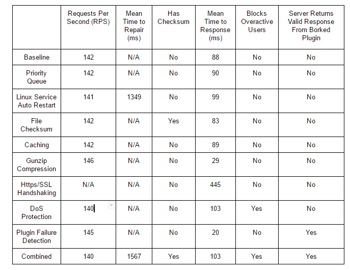

# Simple Web Server for Team #YOLOSWAG *dabs*
Jesse Shellabarger, Tayler How, Collin Trowbridge, Steve Trotta.

## Description
The project is a web server that can handle GET, HEAD, PUT, DELETE, and POST requests. The web server, at the moment, does not handle any other requests. 
The project can be run by downloading the jar and running `java -jar YoloSwagSws-1.0.x.jar`.

## Infrastructure Details
We have devoted two of our assigned VMs to be staging (19) and production (06) servers. You can visit 477-19.csse.rose-hulman.edu/YoloSwagSWS/ or 477-06.csse.rose-hulman.edu/YoloSwagSWS/ to verify. The jar file is deployed to the `/var/www/html/YoloSwagSWS` directory, and we deploy to staging on pushes to master and to prod on new release tags.

The jar file is daemonized as a service using the `/etc/init.d/webserver` file. You can enter `sudo service webserver start|stop|restart|status` in the command line to interact with the service.

We also have a file called `/home/csse/e2e.sh` which gets called upon deployments and runs an end-to-end curl test on the webserver. If the curl GET request does not return a 200 status code, we roll back the webserver to the previously known working version.

## Plugin Deployment Structure
For Servlet plugins, there are a few requirements that must be met to stand up your service.
- The jar's manifest file must include a `Entry-Point` attribute representing the aboslute class name of the AServletManager implementation 
- The jar's manifest file must include a `Context-Root` attribute representing the context root string for URIs to map to
- A plugin must be dropped in the `/home/csse/plugin` directory on the server
- A plugin will have its own directory created for reading and writing located at `/home/csse/"Context-Root-Value"`

## Scenarios and Associated Improvement Tactics
### Availability
#### Server Restart on Failure
The service running the server monitors the server’s health. If the server ever goes down then the service automatically restarts it one second later. The previous implementation would have kept the server down forever if it happened to fail handling a request.
- Source: Unrecoverable State
- Stimulus: Server reaches failing condition
- Environment: Server dies and then restarts
- Artifacts: Complete application server functionality
- Response: Server request gets responded to
- Response Measure: Time to receive response after server restart

We test the server restart by intentionally crashing the server. We then repeatedly issue HTTP requests to the server until we receive a response. Once a response is received, we know that the server is back online. We time how long it takes to restart after we crash it to get our benchmark.
#### DoS Prevention
Tracks the requests users make to blacklist users sending an excessive number of requests
- Source: User using the app			
- Stimulus: Server reaches overwhelming amount of requests
- Environment: Server Overwhelmed with requests
- Artifacts: Server and connection handling
- Response: Other users receive responses
- Response Measure: Overactive user cannot access system

Tested by sending an excessive number of requests from the same IP and confirming that the server begins refusing them. At the same time, verify that other users can access the server. Measure the number of responses per second and the mean response time.
#### Plugin Availability
In the situation that an installed plugin has reached an unusable state, we’d like the server to be aware of the situation and handle it elegantly. To do so, our server checks the heartbeat of the appropriate plugin each time a request is processed. If the plugin’s heartbeat is detected, the request is forwarded to the plugin for regular operation. If a heartbeat is not detected, then the server acts as if the plugin is no longer installed, and responds to the request with a 501 Not Implemented response. The server maintains knowledge of the borked plugin, and will continue to process requests for it while it is down. If the plugin eventually recovers and returns to a usable state, all requests to the plugin thereafter will be processed normally (as the server will be able to detect the heartbeat of the now-fixed plugin).
- Source: User using the app
- Stimulus: Request gets sent to broken plugin
- Environment: Standard server operation with a broken plugin
- Artifacts: Server logic to elegantly handle broken plugins
- Response: Response helpfulness
- Response Measure: Response contains useful information

The testing for this feature is done by simulating a plugin failure with a feature we call “BORK MODE.” If a plugin receives a request with “bork” in the URI, it will enable BORK MODE. In BORK MODE, the plugin will not return a heartbeat when the server checks on it (simulating plugin failure). If the plugin receives a request in BORK MODE (which will happen when our baseline is tested, where our server does not perform heartbeat checks), it purposely causes an exception to simulate failure. To test this, we begin by sending a regular GET request and verify that we receive a 200 OK response to ensure our plugin is working correctly. Then, we send a easter egg bork request to the plugin, which will put it in BORK MODE. The bork request will also cause the intentional exception, which will hang the plugin and result in a SocketTimeoutException (which is caught in the tests). Then, another regular GET request is sent to the now borked plugin, and we verify that we receive a 501 Not Implemented response (instead of hanging and a SocketTimeoutException), which shows that the server has elegantly handled a request to a unusable plugin.
### Performance
#### Caching
To improve performance, the web server should use a simple cache to store responses for recently requested files. If the server receives a GET or HEAD request, it first checks the cache, and if there is a cache entry for the requested resource, it will get the associated response out of the cache and return it. This bypasses unnecessary processing for unchanged files. Cache entries are created when GET or HEAD requests are processed regularly. Cache entries are invalidated when a POST, PUT, or DELETE request is made for that resource.
- Source: User using the app
- Stimulus: GET request for a file that was recently requested
- Environment: Standard operating conditions
- Artifacts: ConnectionHandler logic for caching
- Response: Correct file returned to user
- Response Measure: Time to respond for a cached file

To test this feature, we restart the server (so the cache is clean), and then use Locust to send 10,000 HTTP requests to the server. We record the response time for each request and use the average response time as our primary metric. We also measure the amount of requests processed per second as a secondary metric. Our hopes are that implementation of the caching feature will improve the overall performance of our server.

#### Priority Queue Implementation
In order to ensure quick gets and heads and save larger-bodied requests for later (without starving those requests), I implement a method, size, and time based priority queue for storing connection handler threads and requests. After the current request has been added to the appropriate element of the queue, I poll the same queue and place it in a thread pool for execution.
- Source: Swarm of users using the app at once
- Stimulus: Sending random HTTP requests simultaneously
- Environment: Server is being hit with many requests
- Artifacts: Server module routing to plugin
- Response: Server response accuracy
- Response Measure: Success status codes and how fast to HTTP response

I use the same locust tests as other scenarios with 1000 users terracing up to that level by increments of 100 user steps. I check for the average mean response time and responses per second.

#### Gunzip Implementation
To better facilitate the transfer of large files our server will compress the body of the request before writing it to the network. The implementation sets the Content-Encoding header to “gzip” and replies with a gzipped body to the HTTP Client. On the HTTP Request side, if the client wishes to set their Content-Encoding to gzip, our web server will decompress the body before storing it in the HTTP Request.
- Source: User using the app
- Stimulus: GET request for a large file
- Environment: Standard operating conditions
- Artifacts: ResponseBuilder and Protocol
- Response: Resource requested returned to user
- Response Measure: Time to respond for a large file

We test our Gunzip implementation by sending GET requests and requests that contain bodies. We compared many Locust requests before the implementation with many Locust requests after the implementation. We also measure the number of responses the server can handle per second with the feature enabled and the mean response time for these requests.
### Security
#### Checksum
Each time a GET request is service for a file, an additional header is added to the file. This header is called “checksum” and contains the SHA-256 hash of the file, so that the user can verify that no data was corrupted during network transfer.
- Source: User using the app
- Stimulus: Typical GET request
- Environment: Standard operating conditions
- Artifacts: Response Builder logic to generate checksum
- Response: Server replies with file and a checksum the header
- Response Measure: Checksum header matches the file checksum

Tested by sending GET requests for files with known content from the file. We then verify that the value in the checksum header matches the file’s checksum. We also measure the number of responses the server can handle per second with the feature enabled and the mean response time for these requests.

#### HTTPS
I used a secure socket layer and made a keystore with a self-signed certificate in order to provide at least that form of encryption. I handshake on every request and use the same type of sockets, but the versions that are compatible with SSL overhead. 
- Source: Users using the app
- Stimulus: Typical GET request
- Environment: Standard operating conditions
- Artifacts: Web Server
- Response: All connections are handled via HTTPS
- Response Measure: Time to respond in seconds after HTTPS (Mean Response Time)

Tested by sending all types of requests through the secure socket connection using my self-signed certificate for “sanity checking”. Then I ran our locust tests [without handshaking] at the same 1000 users at terracing of 100 users.

## Improvement Results

## Architecture Diagram

## Module Diagram

## Production Environment Allocation Structure

