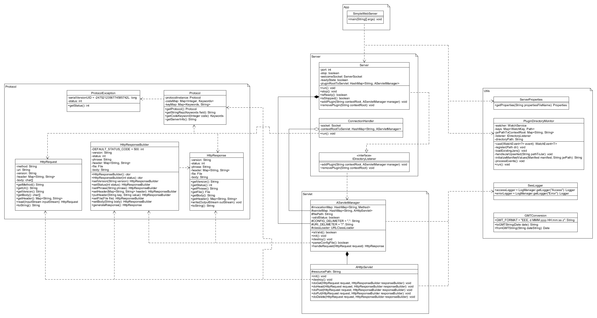
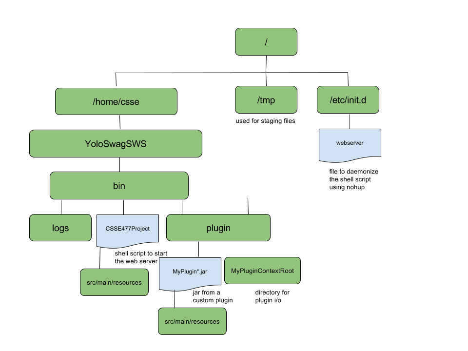

# Simple Web Server for Team #YOLOSWAG *dabs*
Jesse Shellabarger, Tayler How, Collin Trowbridge, Steve Trotta.

## Description
The project is a web server that can handle GET, HEAD, PUT, DELETE, and POST requests. The web server, at the moment, does not handle any other requests. 
The project can be run by downloading the jar and running `java -jar YoloSwagSws-1.0.x.jar`.

## Infrastructure Details
We have devoted two of our assigned VMs to be staging (19) and production (06) servers. You can visit 477-19.csse.rose-hulman.edu/YoloSwagSWS/ or 477-06.csse.rose-hulman.edu/YoloSwagSWS/ to verify. The jar file is deployed to the `/var/www/html/YoloSwagSWS` directory, and we deploy to staging on pushes to master and to prod on new release tags.

The jar file is daemonized as a service using the `/etc/init.d/webserver` file. You can enter `sudo service webserver start|stop|restart|status` in the command line to interact with the service.

We also have a file called `/home/csse/e2e.sh` which gets called upon deployments and runs an end-to-end curl test on the webserver. If the curl GET request does not return a 200 status code, we roll back the webserver to the previously known working version.

## Plugin Deployment Structure
For Servlet plugins, there are a few requirements that must be met to stand up your service.
- The jar's manifest file must include a `Entry-Point` attribute representing the aboslute class name of the AServletManager implementation 
- The jar's manifest file must include a `Context-Root` attribute representing the context root string for URIs to map to
- A plugin must be dropped in the `/home/csse/plugin` directory on the server
- A plugin will have its own directory created for reading and writing located at `/home/csse/"Context-Root-Value"`

## Architecture Diagram

## Module Diagram

## Production Environment Allocation Structure

