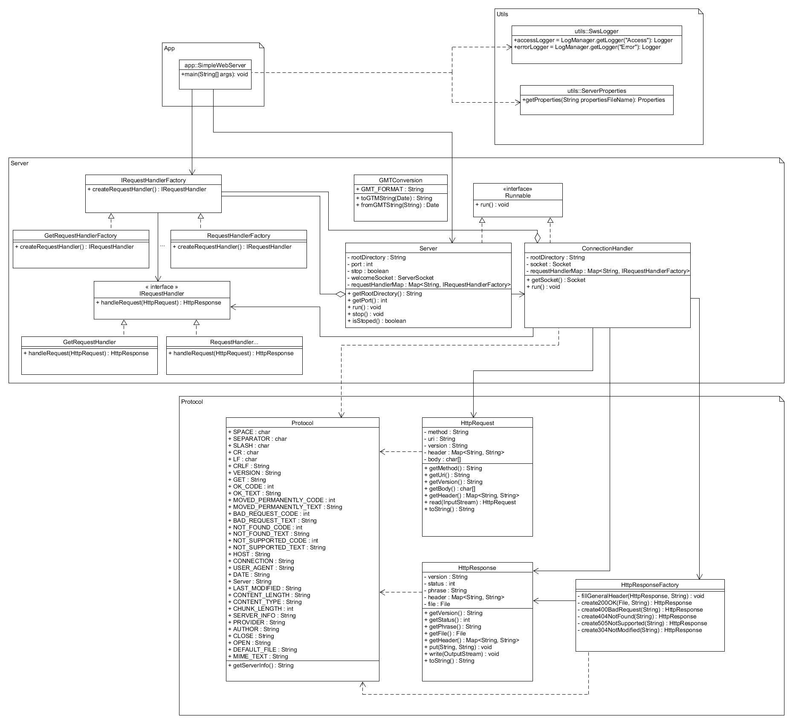
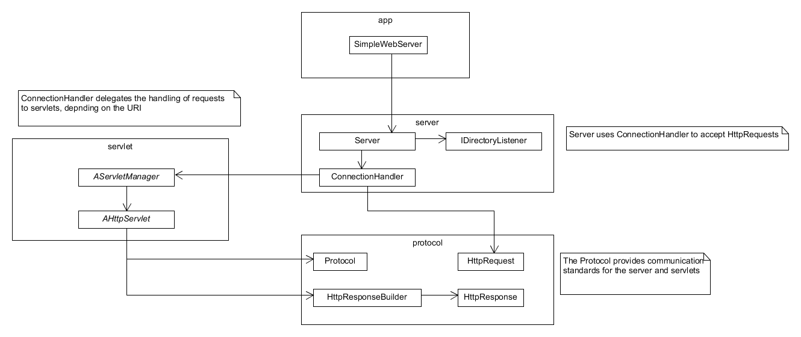

# Simple Web Server

The project is a web server that can handle GET requests. The web server, at the moment, does not handle POST, PUT, DELETE, or HEAD requests.

## Architecture Diagram

## Module Diagram
